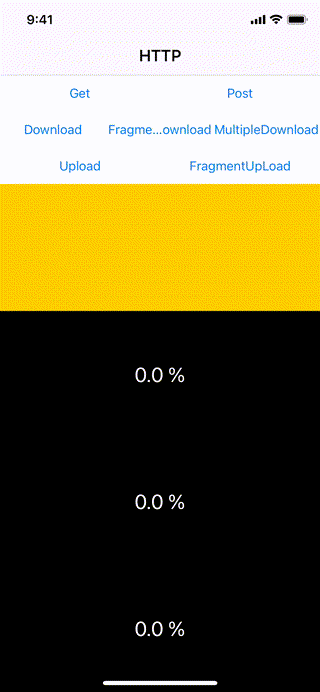

# WWNetworking

[](https://developer.apple.com/swift/) [](https://developer.apple.com/swift/)  [](https://developer.apple.com/swift/) [](https://developer.apple.com/swift/)

## [Introduction - 簡介](https://swiftpackageindex.com/William-Weng)
- This is a simple integration of HTTP transmission, upload and download functions. It is a rare and good tool for iOS engineers.
- 這是一個簡單的HTTP傳輸、上傳、下載功能整合，是iOS工程師不可多得的好工具。



### [Installation with Swift Package Manager](https://medium.com/彼得潘的-swift-ios-app-開發問題解答集/使用-spm-安裝第三方套件-xcode-11-新功能-2c4ffcf85b4b)
```
dependencies: [
    .package(url: "https://github.com/William-Weng/WWNetworking.git", .upToNextMajor(from: "1.4.0"))
]
```

## [Function - 可用函式](https://gitbook.swiftgg.team/swift/swift-jiao-cheng)
### [一般版本](https://medium.com/彼得潘的-swift-ios-app-開發教室/簡易說明swift-4-closures-77351c3bf775)
|函式|功能|
|-|-|
|request(with:urlString:contentType:paramaters:headers:httpBody:result:)|發出URLRequest|
|header(urlString:headers:result:)|取得該URL資源的HEAD資訊|
|upload(with:urlString:formData:parameters:headers:result)|上傳檔案 - 模仿Form|
|fragmentUpload(with:urlString:parameters:filename:delegateQueue:progress:completion:)|分段上傳 - 大型檔案|
|download(with:urlString:delegateQueue:isResume:progress:completion:)|下載資料 - URLSessionDownloadDelegate|
|fragmentDownload(with:delegateQueue:timeoutInterval:progress:completion:)|分段下載|
|multipleDownload(with:urlStrings:delegateQueue:progress:completion:)|下載多筆資料- URLSessionDownloadDelegate|

### [aynsc / await版本](https://youtu.be/s2PiL_Vte4E)
|函式|功能|
|-|-|
|request(with:urlString:contentType:paramaters:headers:httpBody:)|發出URLRequest|
|header(urlString:headers:)|取得該URL資源的HEAD資訊|
|upload(with:urlString:formData:parameters:headers:)|上傳檔案 - 模仿Form|
|fragmentUpload(with:urlString:parameters:filename:delegateQueue:progress:)|分段上傳 - 大型檔案|
|download(with:urlString:delegateQueue:isResume:progress:)|下載資料 - URLSessionDownloadDelegate|
|fragmentDownload(with:delegateQueue:timeoutInterval:progress:)|分段下載|
|multipleRequest(with:)|發出多個request|
|multipleRequestWithTaskGroup(info:)|發出多個request|

## Example
```swift
import UIKit
import WWNetworking

final class ViewController: UIViewController {

    @IBOutlet weak var resultTextField: UITextView!
    @IBOutlet var resultImageViews: [UIImageView]!
    @IBOutlet var resultProgressLabels: [UILabel]!

    private let ImageUrlInfos: [String] = [
        ("https://images-assets.nasa.gov/image/PIA18033/PIA18033~orig.jpg"),
        ("https://images-assets.nasa.gov/image/KSC-20210907-PH-KLS01_0009/KSC-20210907-PH-KLS01_0009~orig.jpg"),
        ("https://images-assets.nasa.gov/image/iss065e095794/iss065e095794~orig.jpg"),
    ]
    
    private let UrlStrings = [
        "GET": "https://httpbin.org/get",
        "POST": "https://httpbin.org/post",
        "DOWNLOAD": "https://raw.githubusercontent.com/William-Weng/AdobeIllustrator/master/William-Weng.png",
        "UPLOAD": "http://172.16.20.43:8080/fileupload",
        "FRAGMENT": "https://photosku.com/images_file/images/i000_803.jpg",
    ]
    
    override func viewDidLoad() { super.viewDidLoad() }
    
    @IBAction func httpGetAction(_ sender: UIButton) { httpGetTest() }
    @IBAction func httpPostAction(_ sender: UIButton) { httpPostTest() }
    @IBAction func httpDownloadAction(_ sender: UIButton) { httpDownloadData() }
    @IBAction func httpFragmentDownloadAction(_ sender: UIButton) { fragmentDownloadData() }
    @IBAction func httpMultipleDownloadAction(_ sender: UIButton) { httpMultipleDownload() }
    @IBAction func httpUploadAction(_ sender: UIButton) { httpUploadData() }
    @IBAction func httpFragmentUpLoad(_ sender: UIButton) { httpFragmentUploadData() }
}

// MARK: - ViewController (private class function)
extension ViewController {

    /// 測試GET (GET不能有httpBody)
    private func httpGetTest() {
        
        let urlString = UrlStrings["GET"]!
        let parameters: [String: String?] = ["name": "William.Weng", "github": "https://william-weng.github.io/"]

        WWNetworking.shared.request(with: .GET, urlString: urlString, paramaters: parameters) { result in

            switch result {
            case .failure(let error): self.displayText(error)
            case .success(let info): self.displayText(info.data?._jsonSerialization())
            }
        }
    }

    /// 測試POST
    private func httpPostTest() {
        
        let urlString = UrlStrings["POST"]!
        let parameters: [String: String?] = ["name": "William.Weng", "github": "https://william-weng.github.io/"]
        
        WWNetworking.shared.request(with: .POST, urlString: urlString, paramaters: nil, httpBody: parameters._jsonSerialization()) { result in

            switch result {
            case .failure(let error): self.displayText(error)
            case .success(let info): self.displayText(info.data?._jsonSerialization())
            }
        }
    }
    
    /// 上傳圖片
    private func httpUploadData() {
        
        let urlString = UrlStrings["UPLOAD"]!
        let imageData = resultImageViews[0].image?.pngData()
        
        WWNetworking.shared.upload(urlString: urlString, parameters: ["file_to_upload": imageData!], filename: "Demo.png") { result in
            
            switch result {
            case .failure(let error): self.displayText(error)
            case .success(let info): self.displayText("\(info.data?._jsonSerialization() ?? "NOT JSON")")
            }
        }
    }
    
    /// 上傳圖片 (大型檔案)
    private func httpFragmentUploadData() {
        
        let urlString = UrlStrings["UPLOAD"]!
        let index = 1
        let imageData = resultImageViews[index].image?.pngData()
                
        _ = WWNetworking.shared.fragmentUpload(urlString: urlString, parameters: ["x-filename": imageData!], filename: "Large.png", progress: { info in
            
            let progress = Float(info.totalBytesSent) / Float(info.totalBytesExpectedToSend)
            DispatchQueue.main.async { self.title = "\(progress)" }
            
        }, completion: { result in
            
            switch result {
            case .failure(let error): self.displayText(error)
            case .success(let isSuccess): self.displayText(isSuccess)
            }
        })
    }
    
    /// 下載檔案 (單個)
    private func httpDownloadData() {
        
        let urlString = UrlStrings["DOWNLOAD"]!
        let index = 0
        
        self.displayText("")
        
        _ = WWNetworking.shared.download(urlString: urlString, progress: { info in
            
            let progress = Float(info.totalWritten) / Float(info.totalSize)
            self.displayProgressWithIndex(index, progress: progress)
                        
        }, completion: { result in
            
            switch result {
            case .failure(let error): self.displayText(error)
            case .success(let info): self.displayImageWithIndex(index, data: info.data)
            }
        })
    }
    
    /// 分段下載 (單一檔案分多點合併下載)
    private func fragmentDownloadData() {
        
        let urlString = UrlStrings["FRAGMENT"]!
        let index = 1
        let fragmentCount = 10
        
        self.displayText("")
        
        WWNetworking.shared.fragmentDownload(with: urlString, fragment: fragmentCount, progress: { info in
            
            let progress = Float(info.totalWritten) / Float(info.totalSize)
            self.displayProgressWithIndex(index, progress: progress)
            
        }, completion: { result in
            
            switch result {
            case .failure(let error): self.displayText(error)
            case .success(let data): self.displayImageWithIndex(index, data: data)
            }
        })
    }
    
    /// 下載檔案 (多個檔案)
    private func httpMultipleDownload() {
        
        resultImageViews.forEach { $0.image = nil }
        
        let _ = WWNetworking.shared.multipleDownload(urlStrings: ImageUrlInfos) { info in
            
            guard let index = self.displayImageIndex(urlStrings: self.ImageUrlInfos, urlString: info.urlString),
                  let progress = Optional.some(Float(info.totalWritten) / Float(info.totalSize))
            else {
                return
            }

            self.displayProgressWithIndex(index, progress: progress)
            
        } completion: { result in
            
            switch result {
            case .failure(let error): self.displayText(error)
            case .success(let info):
                guard let index = self.displayImageIndex(urlStrings: self.ImageUrlInfos, urlString: info.urlString) else { return }
                self.displayImageWithIndex(index, data: info.data)
            }
        }
    }
}

// MARK: - 小工具 (class function)
extension ViewController {
    
    /// 顯示進度百分比
    /// - Parameters:
    ///   - index: Int
    ///   - progress: Float
    private func displayProgressWithIndex(_ index: Int, progress: Float) {
        self.resultProgressLabels[index].text = "\(progress * 100.0) %"
    }
    
    /// 顯示圖片
    /// - Parameters:
    ///   - index: Int
    ///   - data: Data?
    private func displayImageWithIndex(_ index: Int, data: Data?) {
        guard let data = data else { return }
        self.resultImageViews[index].image = UIImage(data: data)
    }
    
    /// 顯示文字
    /// - Parameter text: Any?
    private func displayText(_ text: Any?) {
        DispatchQueue.main.async { self.resultTextField.text = "\(text ?? "NULL")" }
    }
    
    /// 尋找UIImageViewd的index
    /// - Parameters:
    ///   - urlStrings: [String]
    ///   - urlString: String?
    /// - Returns: Int?
    private func displayImageIndex(urlStrings: [String], urlString: String?) -> Int? {
        
        guard let urlString = urlString,
              let index = urlStrings.firstIndex(of: urlString)
        else {
            return nil
        }

        return index
    }
}

// MARK: - Dictionary (class function)
extension Dictionary {
    
    /// Dictionary => JSON Data
    /// - ["name":"William"] => {"name":"William"} => 7b226e616d65223a2257696c6c69616d227d
    /// - Returns: Data?
    func _jsonSerialization() -> Data? {
        
        guard JSONSerialization.isValidJSONObject(self),
              let data = try? JSONSerialization.data(withJSONObject: self, options: JSONSerialization.WritingOptions())
        else {
            return nil
        }
        
        return data
    }
}

// MARK: - Data (class function)
extension Data {
    
    /// Data => JSON
    /// - 7b2268747470223a2022626f6479227d => {"http": "body"}
    /// - Returns: Any?
    func _jsonSerialization(options: JSONSerialization.ReadingOptions = .allowFragments) -> Any? {
        let json = try? JSONSerialization.jsonObject(with: self, options: options)
        return json
    }
}
```
